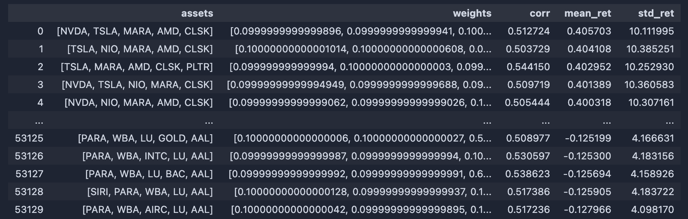
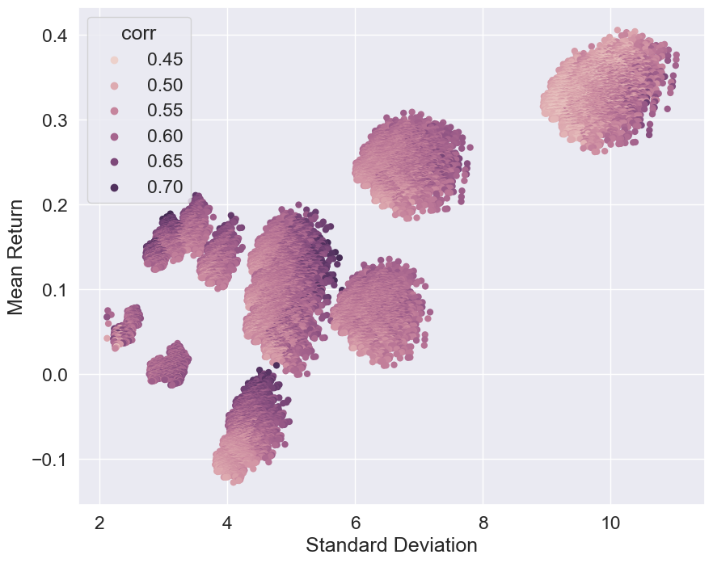

# Portfolio Otimization
 
Example of portfolio optimization using daily data and the Sharpe ratio. 

## Dataset
The dataset can be built from any ticker present in Yahoo Finance, by simply calling the DataSource class.
For instance:
```python
from DataSource import DataSource
import pandas as pd

tickers = ['NVDA', 'TSLA', 'SIRI', 'NIO']
data = DataSource(tickers, '2018-01-01', '2024-01-01')
data.get_data()
```

Moreoever, a list of tickers from different asset classes can be found in the tickers folder by simply using the following code:
```python
asset_classes = ['stocks',]

all_tickers = pd.concat([pd.read_csv(f'tickers/{asset_class}.csv', sep=',') for asset_class in asset_classes])
tickers = all_tickers['ticker'].values
```

As an example, let us use a list of the following stocks:
```python
tickers = ['NVDA', 'TSLA', 'SIRI', 'NIO', 'RIVN', 'AAPL', 'PARA', 'LCID',
       'AMZN', 'MARA', 'VALE', 'AMD', 'WBA', 'F', 'INTC', 'AIRC', 'LU',
       'XPEV', 'CLSK', 'GOLD', 'PLTR', 'BAC', 'IREN', 'AAL', 'ITUB']
```

Weights are optimized to minimize the portfolio variance and maximize the return.

## Optimization
Given a fixed number of asset per portfolio, optimization is performed by the Portfolio class, which works in two steps:
1. For all the possible combinations of assets, the Portfolio class calculates the optimal weights that minimize the portfolio variance while maximizing the return.
2. The Portfolio class returns all portfolios, sorted by the different metrics, such as the Sharpe ratio, return, volatility and correlation.

An example of possible output is the following:


Which can be represented as follows, where the x-axis represents the volatility and the y-axis the return:

Each point represents a portfolio, where the color represents the correlation between the assets in the portfolio.